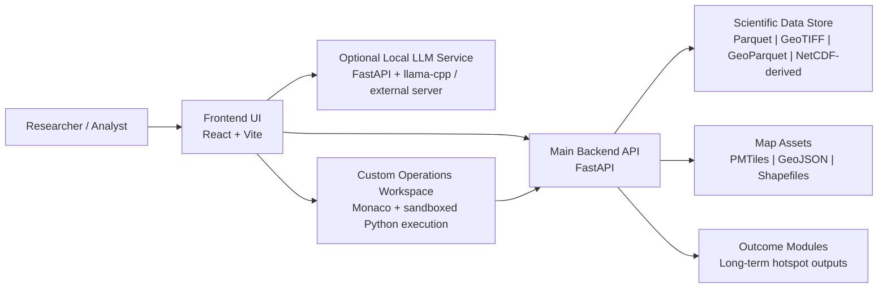
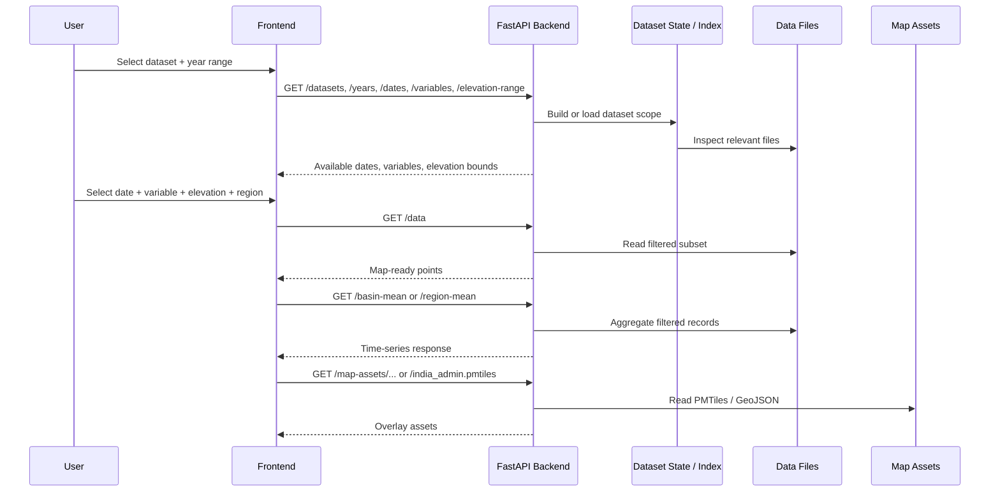
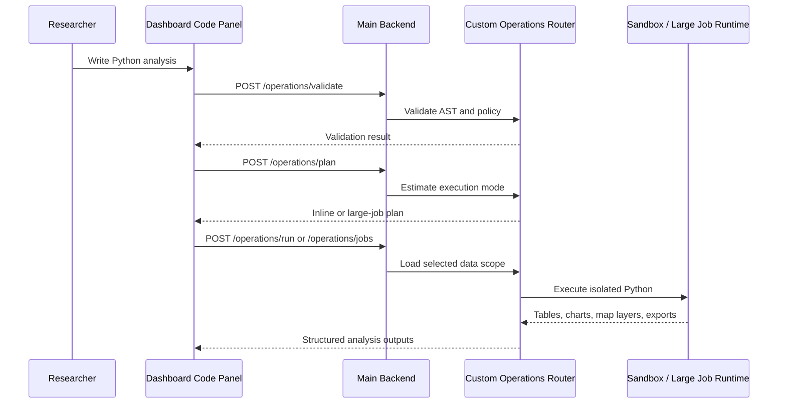
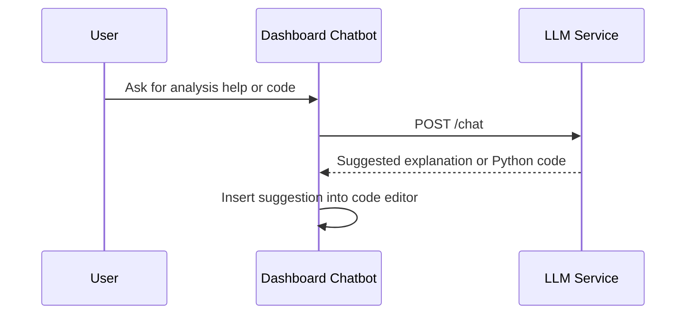

# Himalaya Basin Analytics System Architecture

## 1. Purpose

This document describes the complete software architecture of the Himalayan Basin Analytics visualization platform in a modular, research-friendly form. It is intended for:

- project documentation
- internship and technical reporting
- journal or conference method sections
- onboarding new developers and researchers

The platform is a **local-first geospatial analytics system** for Himalayan basin, cryosphere, and hydro-climatic visualization. It combines interactive map rendering, temporal analytics, precomputed scientific outcomes, user-uploaded datasets, and optional AI-assisted analysis.

## 2. Architectural Summary

At a high level, the system follows a **layered modular architecture**:

1. **Presentation layer**: React-based frontend for interaction, map rendering, graphing, and documentation.
2. **Application layer**: FastAPI backend for dataset discovery, filtering, aggregation, and scientific query orchestration.
3. **Data layer**: Local scientific datasets stored as Parquet, GeoTIFF, GeoParquet, PMTiles, GeoJSON, and uploaded NetCDF-derived outputs.
4. **Analysis extension layer**: sandboxed custom Python operations and precomputed outcome modules.
5. **Optional intelligence layer**: local LLM service for code-generation and analysis assistance.
6. **Packaging and deployment layer**: scripts for local development, offline bundling, and hosted backend deployment.

## 3. System Context

## 4. Core Design Principles

- **Local-first execution**: the platform is designed to work on a local workstation without requiring cloud-only services.
- **Scientific reproducibility**: data selection is explicit through dataset, year range, variable, elevation range, and optional region or glacier filtering.
- **Format-aware processing**: the backend treats Parquet, GeoTIFF, and GeoParquet datasets differently instead of forcing one abstraction for all data.
- **Incremental loading**: only the active scope is loaded and queried, which keeps the system usable for large geospatial datasets.
- **Extensibility**: new datasets, derived outcomes, and analysis tools can be added without rewriting the whole application.
- **Offline portability**: the application can be bundled into a portable runtime for disconnected use.

## 5. Module Decomposition

### 5.1 Frontend Layer

Primary location:

- `frontend/src/App.jsx`
- `frontend/src/components/`
- `frontend/src/services/api.js`
- `frontend/src/services/llmService.js`

Key frontend modules:

| Module | Role |
|---|---|
| `App.jsx` | Main orchestration layer for dataset selection, state management, dashboard mode, outcome mode, documentation mode, year-range setup, and request lifecycles. |
| `MapView.jsx` | Interactive geospatial rendering using Deck.GL and MapLibre. Displays points, overlays, selected regions, glaciers, and analysis results. |
| `TimeSlider.jsx` | Temporal navigation for daily frames and playback. |
| `TempGraph.jsx` | Basin or region time-series visualization. |
| `ElevationFilter.jsx` | Elevation-range selection and user filtering controls. |
| `DocumentationPage.jsx` | In-app scientific documentation and interpretation notes. |
| `OutcomeLongTermHotspotPage.jsx` | Presentation layer for precomputed long-term hotspot outputs. |
| `DashboardCodePanel.jsx` | Advanced analysis workspace with Monaco editor, sandbox execution, tabbed outputs, and optional chatbot. |
| `OperationChartRenderer.jsx` | Rendering of charts returned from custom code execution. |
| `api.js` | Typed client-side gateway to the FastAPI backend with LRU-style response caching and request deduplication. |
| `llmService.js` | Client for the optional local LLM service on port `8010`. |

Frontend characteristics:

- lazy loading is used for heavy views such as map, graphs, documentation, outcomes, and code workspace
- the client caches repeated API responses to reduce unnecessary requests
- stale map and graph requests are canceled when the user changes filters quickly
- the dashboard supports multiple modes: dataset dashboard, outcome viewer, scientific documentation, code workspace, and chatbot

### 5.2 Main Backend Layer

Primary location:

- `backend/main.py`

The FastAPI backend is the scientific control layer of the system. It is responsible for:

- dataset registration and runtime discovery
- year/date/variable/elevation indexing
- query filtering by time, elevation, subregion, glacier, and bounding box
- map-ready point extraction
- basin and region aggregation
- hotspot trend computation
- serving static map assets and packaged frontend files
- integrating custom analysis routes
- managing uploaded NetCDF datasets
- loading precomputed outcomes

Key backend concerns in `backend/main.py`:

| Backend concern | Description |
|---|---|
| Runtime path resolution | Supports both source-mode execution and packaged executable mode. |
| Dataset registry | Defines supported datasets such as `era5`, `cmip6`, `sphy_model`, `chirps`, `mod10a1_monthly`, `discharge_network`, and uploaded NetCDF datasets. |
| Format-specific handlers | Uses different code paths for Parquet, GeoTIFF, and GeoParquet storage. |
| Spatial filtering | Supports basin/subregion filtering, glacier lookup, and region bounding-box analysis. |
| Outcome management | Loads and serves precomputed long-term hotspot outputs. |
| Frontend hosting | Serves built frontend assets and SPA fallback in packaged mode. |

### 5.3 Data Access and Storage Layer

Main runtime data locations:

- `Database/`
- `Map_handle/`
- `Glacier_shp/`
- `Outcomes/`
- `Himalaya_shape/`

Supported storage classes:

| Data class | Storage format | Purpose |
|---|---|---|
| Climate point datasets | Parquet | Fast filtering of daily climate and hydro-meteorological variables. |
| Snow/albedo rasters | GeoTIFF | Raster-based snow and albedo visualization. |
| Network geospatial datasets | GeoParquet | Efficient vector storage for discharge-style spatial networks. |
| Administrative/context layers | PMTiles, GeoJSON | Lightweight map delivery and overlay rendering. |
| Glacier and basin boundaries | Shapefile / GeoParquet | Region and glacier-specific filtering and visualization. |
| Derived outcome products | Parquet + JSON metadata | Precomputed scientific outputs such as long-term hotspot summaries. |
| User-uploaded datasets | NetCDF converted to Parquet | Researcher-supplied data integrated into the app at runtime. |

### 5.4 Custom Operations Layer

Primary location:

- `backend/custom_operations/`
- `frontend/src/components/DashboardCodePanel.jsx`

This subsystem adds a **research sandbox** for user-defined Python analytics against the currently selected dataset context.

Key modules:

| Module | Role |
|---|---|
| `router.py` | Exposes `/operations/*` API routes. |
| `planner.py` | Decides whether a selection can run inline or must become a large job. |
| `data_access.py` | Loads filtered scientific data from the main backend into operation-friendly dataframes. |
| `sandbox.py` | Executes user code in isolated subprocesses with limits. |
| `worker.py` | Runtime for inline code execution and output capture. |
| `large_jobs.py` | Job manager for long-running or high-volume analyses. |
| `large_worker.py` | Chunked large-range execution support. |
| `security.py` | AST validation, import restrictions, and policy checks. |
| `schemas.py` | Typed request and response contracts. |

Outputs supported by the custom operations layer:

- text summaries
- scalar metrics
- tables
- charts
- map layers
- CSV/JSON exports

This module is especially important for research because it turns the visualization platform into a **semi-programmable analysis environment** rather than a fixed dashboard.

### 5.5 Optional LLM Assistance Layer

Primary location:

- `LLM_service/`
- `frontend/src/services/llmService.js`
- `frontend/src/components/DashboardCodePanel.jsx`

The LLM subsystem is intentionally separate from the main visualization backend. It runs on port `8010` and provides:

- health/model status
- chat-style assistance
- prompt-based code or explanation generation

Its main role is to support:

- code suggestions for the custom operations workspace
- explanation of dashboard outputs
- contextual assistance tied to the currently selected dataset, date, variable, elevation range, and subregion

The separation of this service from the main API is architecturally useful because it keeps core scientific querying independent from optional AI tooling.

### 5.6 Outcome Module Layer

Primary location:

- `Outcomes/Long_term_hotspot/`
- backend outcome routes in `backend/main.py`
- `frontend/src/components/OutcomeLongTermHotspotPage.jsx`

Outcome modules are precomputed scientific products that are not generated interactively on each dashboard action. The current implementation includes a **long-term hotspot analysis module** with:

- metadata JSON
- band-mean Parquet outputs
- band-difference Parquet outputs
- dedicated frontend presentation

This creates a clear architectural distinction between:

- **interactive exploratory analytics**, and
- **precomputed reproducible scientific outcomes**

### 5.7 Packaging and Deployment Layer

Primary location:

- `pack_offline.ps1`
- `start.bat`
- `stop.bat`
- `HF_DEPLOYMENT.md`
- `LLM_service/pack_offline.ps1`

The system supports multiple runtime modes:

| Mode | Description |
|---|---|
| Developer mode | Frontend and backend started separately for iterative development. |
| Local integrated mode | Frontend talks to a locally running backend. |
| Offline packaged mode | Frontend build, backend runtime, data, and map assets are bundled into a portable package. |
| Hosted backend mode | Backend can be deployed remotely while frontend stays separately hosted. |
| Optional local AI mode | LLM service is started as an additional local process. |

## 6. End-to-End Runtime Flow

### 6.1 Standard Visualization Workflow

### 6.2 Custom Research Workflow

### 6.3 Optional LLM-Assisted Workflow

## 7. API Surface by Functional Group

### 7.1 Discovery and Scope Setup

- `GET /datasets`
- `GET /years`
- `GET /dates`
- `GET /variables`
- `GET /elevation-range`
- `GET /stats`

### 7.2 Core Visualization and Analytics

- `GET /data`
- `GET /basin-mean`
- `GET /region-mean`
- `GET /hotspot-trends`

### 7.3 Spatial Context and Assets

- `GET /map-assets/{asset_path}`
- `GET /india_admin.pmtiles`
- `GET /subregions`
- `GET /subregions/{subregion_id}/geometry`
- `GET /glaciers/overview`

### 7.4 Precomputed Outcomes

- `GET /outcomes`
- `GET /outcomes/long-term-hotspot/meta`
- `GET /outcomes/long-term-hotspot/data`
- `GET /outcomes/long-term-hotspot/difference`

### 7.5 Dataset Extension

- `POST /nc/upload`

### 7.6 Research Sandbox

- `GET /operations/capabilities`
- `POST /operations/plan`
- `POST /operations/validate`
- `POST /operations/run`
- `POST /operations/jobs`
- `GET /operations/jobs/{job_id}`
- `GET /operations/jobs/{job_id}/logs`
- `POST /operations/jobs/{job_id}/cancel`

## 8. Data Lifecycle

The platform follows a staged data lifecycle:

1. **Acquisition**: data are sourced from climate, cryosphere, model, and map products.
2. **Preparation**: raw files are transformed using converters such as Parquet or NetCDF ingestion scripts.
3. **Registration**: datasets are listed in backend configuration and indexed at runtime.
4. **Query-time filtering**: active requests constrain the data by year range, date, variable, elevation, and region.
5. **Visualization or aggregation**: the filtered subset is returned either as map points or as analytic summaries.
6. **Derived analysis**: users may run sandboxed Python or consume outcome modules.
7. **Packaging**: the working stack can be bundled for offline use.

## 9. Architectural Strengths

This architecture is well suited to research and documentation work because it offers:

- clear separation between visualization, query execution, and derived analysis
- support for heterogeneous scientific data formats
- reproducible selection context for each analytic result
- room for both interactive and precomputed workflows
- an extendable model where future datasets and outcomes can be added with limited disruption

## 10. Current Limitations and Engineering Tradeoffs

- `backend/main.py` acts as a large integration module, which is practical but centralizes many responsibilities.
- dataset definitions are configuration-like but still embedded in Python rather than fully externalized metadata files.
- the custom operations layer is suitable for controlled local or institutional use, but public multi-user deployment would need a stronger sandbox boundary.
- the optional LLM service is operationally separate, which is good for isolation but adds another local process to manage.
- scientific preprocessing remains partly external to the runtime app, so provenance should be documented carefully for publication.

## 11. Recommended Future Refactoring Path

For long-term maintainability, the next architectural evolution could split the backend into:

1. `dataset_registry`
2. `query_engine`
3. `spatial_index_service`
4. `outcome_service`
5. `asset_service`
6. `upload_ingestion_service`
7. `api_router`

That would preserve the current behavior while improving testability and module ownership.

## 12. Journal-Friendly Description

The following paragraph can be adapted directly into a report or paper:

> The visualization platform was implemented as a modular local-first geospatial analytics system composed of a React- and Deck.GL-based presentation layer, a FastAPI-based scientific query layer, and a multi-format local storage layer containing Parquet, GeoTIFF, GeoParquet, PMTiles, and vector boundary assets. The backend performs dataset indexing, temporal and elevation-based filtering, spatial subsetting, aggregation, and hotspot analysis, while the frontend supports interactive exploration through maps, time-series plots, region selection, and documentation views. In addition to standard visualization workflows, the system includes a sandboxed custom-analysis module for user-defined Python operations and an optional local large-language-model service for code and interpretation assistance. The architecture was designed to support reproducible basin-scale climate and cryosphere analysis under offline or low-connectivity conditions.

## 13. Practical File Map

| Area | Main path |
|---|---|
| Main backend | `backend/main.py` |
| Dataset ingestion | `backend/nc_ingest.py`, `backend/convert_csv_to_parquet.py` |
| Custom operations engine | `backend/custom_operations/` |
| Frontend entrypoint | `frontend/src/App.jsx` |
| Frontend API client | `frontend/src/services/api.js` |
| Optional LLM client | `frontend/src/services/llmService.js` |
| Optional LLM backend | `LLM_service/` |
| Map assets | `Map_handle/` |
| Scientific datasets | `Database/` |
| Outcomes | `Outcomes/` |
| Packaging | `pack_offline.ps1`, `start.bat`, `stop.bat` |

## 14. Conclusion

The system is not only a visualization dashboard; it is a **modular scientific computing environment for Himalayan basin analysis**. Its architecture supports:

- interactive climate and cryosphere exploration
- reproducible filtered analysis
- custom code-driven research extensions
- precomputed scientific products
- optional AI-assisted workflows
- offline and portable deployment

For documentation and research purposes, it can therefore be described as a **hybrid geospatial analytics architecture** that bridges scientific datasets, interactive visualization, and programmable analysis in a single local-first platform.
